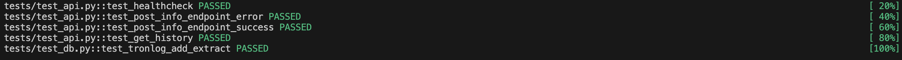

# Tron Info Microservice
Микросервис на FastAPI для получения информации об адресе в сети TRON (trx-балансе, bandwidth, и energy). Микросервис сохраняет историю запросов в базу данных с возможностью просмотра через API.

* Для запуска использовать команду
```
docker-compose up -d
```

* Для остановки работы сервисов
```
docker-compose down
```

# Эндпоинты
* `GET /healthcheck` 
Проверка работы микросервиса. 

Response:
```
{
    "status": "ok"
}
```

* `POST /tron/info`
Получение информации о TRON-адресе и запись в базу данных.

Request:
```
{
  "address": "<your_address>"
}
```
Response:
```
{
  "address": "<your_address>",
  "balance": <address_info>,
  "bandwidth": <address_info>,
  "energy": <address_info>
}
```

* `GET /tron/history`
Получение списка последних запросов с пагинацией. По умолчанию `page = 1` и `per_page = 10`
Request:
```
?page=1&per_page=10
```
Response:
```
[
  {
    "address": "<first_address>",
    "balance": <info>,
    "bandwidth": <info>,
    "energy": <info>
  },
  ...
]
```

* Более подробно смотрите информацию `localhost:8000/docs`

# Tесты
Все тесты находятся по пути `tests/`. В качестве базы данных используется PostgreSQL, поэтому для проверки дополнительно использовалась библиотека `testcontainers`.

* Для запуска тестов необходимо установить uv и docker, после 
```
uv venv
uv sync && uv sync --dev
uv run pytest -v
```

Результаты работы:


# Code style
В качестве утилит для поддержки кода используются `ruff` и `mypy`. Все настройки могут быть найдены в `pyproject.toml`.

Для проверки запустить скрипт (предварительно делаем его исполняемым, и проверяем наличие uv и созданным им виртуальным окружением):
```
./check.sh
```